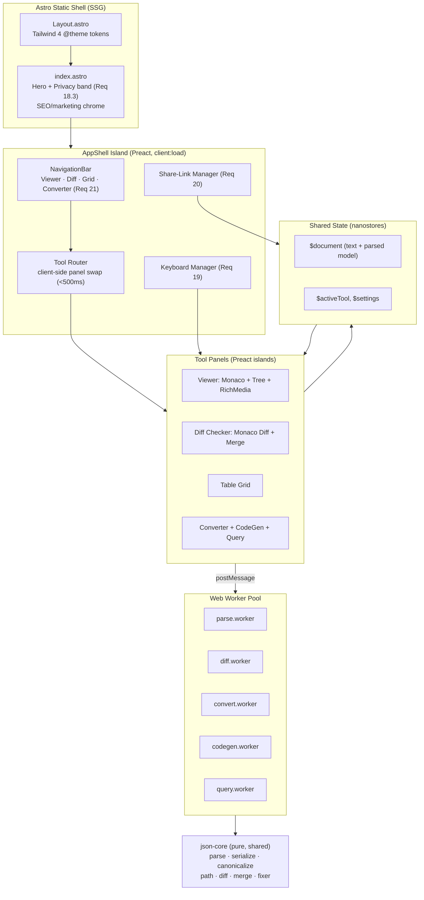
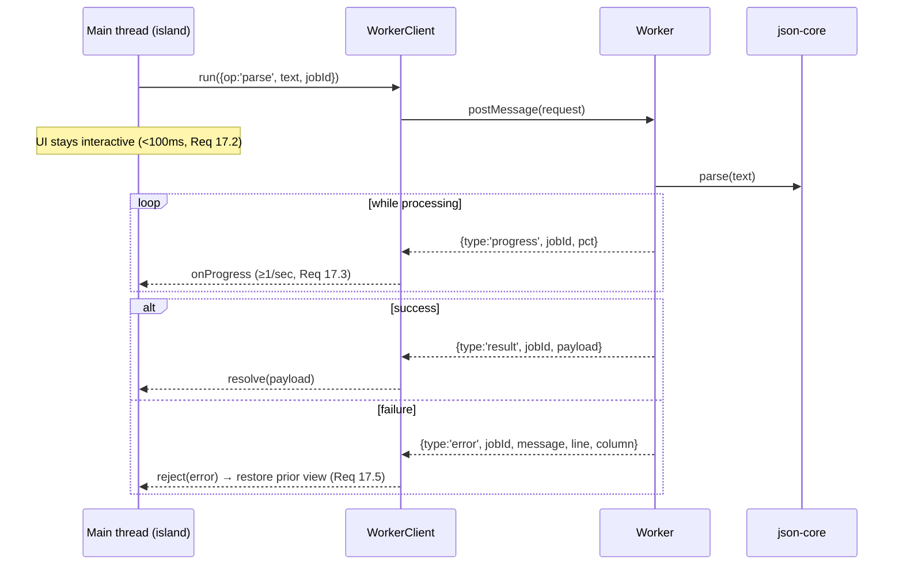
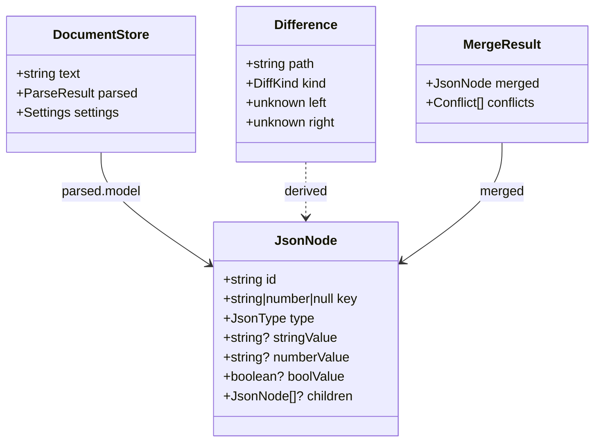
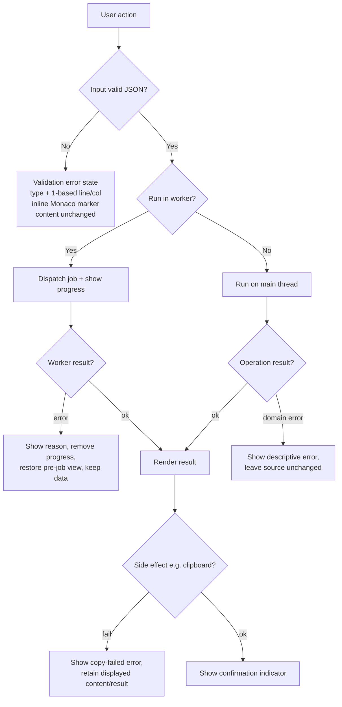

# Design Document: Json Viewer Free

## Overview

Json Viewer Free is a 100% client-side JSON workbench built on AstroJS, the Monaco editor, and Tailwind 4. The product unifies a viewer/tree editor, formatter/minifier, validator with smart auto-repair, semantic diff/merge, rich-media inference, multi-format converters, code generators, a tabular grid, and expression querying behind a single navigation (`Viewer | Diff Checker | Table Grid | Converter`). All processing happens in the browser; heavy work is offloaded to Web Workers so the UI never freezes, even at the 50 MB ceiling defined for querying and the 5 MB ceiling defined for most transforms.

The design has three pillars:

1. **A shared, order- and precision-preserving JSON core.** A single in-memory document model (`JsonNode`) backs every tool. It preserves object key order, array order, and full numeric precision (via lossless parsing), which is the foundation for the round-trip, diff-soundness, patch-correctness, and share round-trip properties the requirements demand.
2. **A worker-first execution model.** Parsing, diffing, patch generation, conversion, code generation, and querying run inside dedicated Web Workers behind a uniform request/response/progress protocol. The main thread stays responsive (<100 ms input response) and shows a progress indicator for any long-running job.
3. **A static Astro shell with hydrated islands.** Astro renders the marketing/privacy chrome and SEO surface statically; the interactive workbench is a small set of Preact islands sharing state through nanostores. The Vercel-inspired design system from `DESIGN.md` is mapped to Tailwind 4 `@theme` tokens so all chrome derives from tokens (Requirement 22.1).

### Research Summary and Key Library Decisions

Research was conducted to choose well-maintained libraries and avoid re-implementing solved problems. Versions are pinned in `package.json` (caret ranges shown are the floor we pin against).

| Concern | Choice | Version | Rationale / Build-vs-Buy |
|---|---|---|---|
| Editor | `monaco-editor` | `^0.52.0` | Same engine as VS Code; gives validation markers, inline error highlight (Req 6.5), and a native diff editor for side-by-side + inline views (Req 9). Buy. |
| Lossless parse | `lossless-json` | `^4.0.1` | Parses numbers into `LosslessNumber` (string-backed), preserving precision and big integers — required for numeric-precision round-trips (Req 20.6). Buy. |
| Tolerant parse / error location | `jsonc-parser` | `^3.3.1` (already present) | Error-recovering scanner used by the Smart Fixer and to report first-error line/column (Req 6.4, 7.7). Buy. |
| RFC 6902 patch | `fast-json-patch` | `^3.1.1` | `compare()` emits a minimal, spec-conformant add/remove/replace patch; `applyPatch()` is the reference applier we test patch-correctness against (Req 10). Buy. |
| YAML | `js-yaml` | `^4.1.0` (already present) | Mature, lossless enough for round-trip ignoring key order (Req 13.7). Buy. |
| TOML | `smol-toml` | `^1.3.4` (already present) | Spec-compliant TOML parse/stringify for round-trip (Req 13.8). Buy. |
| XML | `fast-xml-parser` | `^4.5.0` | Bidirectional JSON↔XML with builder + parser, configurable. Buy. |
| CSV | `papaparse` | `^5.4.1` | Robust CSV serialize/parse with correct quoting/escaping (Req 13.3). Buy. |
| Code generation | `quicktype-core` | `^23.0.170` | Generates TypeScript, Java, Go, Python, and Dart from a JSON sample in one library — exactly the five target languages (Req 14.1–14.5). Re-implementing five language emitters is infeasible. Buy. |
| JSONPath | `jsonpath-plus` | `^10.3.0` | Feature-complete JSONPath. **Caveat:** versions `<10.0.0` carry an RCE advisory (CVE-2024-21534); we pin `>=10.3.0` and run it only inside a Worker with no `eval`-enabling options. |
| JMESPath | `jmespath` | `^0.16.0` | The reference JS implementation of the JMESPath spec. Buy. |
| Virtualization | `@tanstack/virtual-core` | `^3.13.0` | Framework-agnostic windowing for the tree (Req 1) and grid (Req 15) at 50 MB scale. Buy. |
| Share-link compression | `fflate` | `^0.8.2` | Small, fast raw-DEFLATE; combined with base64url for compact, URL-safe hash payloads (Req 20). Buy. |
| Island framework | `preact` + `@astrojs/preact` | `preact ^10.24.0`, integration `^4.0.0` | Lightweight (~4 KB) React-compatible runtime for interactive islands. Buy. |
| Shared state | `nanostores` + `@nanostores/preact` | `^0.11.3` / `^0.6.0` | Astro's recommended cross-island store; backs the shared document. Buy. |
| Styling | `tailwindcss` + `@tailwindcss/vite` | `^4.0.0` | Tailwind 4 with `@theme` tokens mapped from `DESIGN.md`. Buy. |
| Property testing | `fast-check` + `@fast-check/vitest` | `^3.23.0` / `^0.1.3` | Property-based testing integrated with Vitest. Buy. |
| Unit/test runner | `vitest` + `jsdom` | `^2.1.0` | Fast Vite-native test runner aligned with Astro's Vite pipeline. Buy. |

**Semantic diff (Req 8) is built, not bought.** No off-the-shelf library matches our exact classification contract (addition/deletion/modification keyed by JSON_Path with structural equivalence). We implement it on top of the canonicalization core (a small, fully testable pure function), and reuse `fast-json-patch.compare()` for the RFC 6902 export. **Three-way merge (Req 11)** is likewise built on the diff core.

## Architecture

### High-Level Architecture



### Execution Model and Routing

- **Single-page app shell.** The homepage (`index.astro`) statically renders the Vercel-style hero band and the always-visible privacy statement (Req 18.3), then mounts one `AppShell` island (`client:load`). The four tools are panels swapped client-side, so switching is in-memory and well under 500 ms (Req 21.2) and the shared document is preserved across switches without re-parsing (Req 21.5, 21.6). The active tool is mirrored into the URL (`#tool=diff`) so navigation is linkable and survives reload.
- **Why not separate routes per tool?** Full page navigations would discard in-memory parsed state and force re-parse/re-hydration, jeopardizing the 500 ms switch and the "retain in memory" requirements. A client-side panel router keeps the shared `$document` store alive.
- **Shared document.** All four tools read/write a single nanostore `$document`. The Viewer/Grid/Converter operate on this shared document; the Diff Checker maintains its own Left/Right/Base buffers but seeds Left from the shared document on entry (Req 21.5/21.6).

### Worker Strategy



**Which subsystems run in a worker:** parsing/validation of any document ≥ the Large_Document threshold (5 MB, Req 17.1), semantic diff, RFC 6902 patch generation, three-way merge, all converters, code generation, and query evaluation. Small documents (< 5 MB) parse synchronously on the main thread for snappy feedback; the same `json-core` functions run in both contexts, so behavior is identical.

**Message protocol.** Every job is a tagged request `{ jobId, op, payload }`. Workers reply with exactly one terminal message (`result` or `error`) and zero or more `progress` messages. `op` ∈ `parse | validate | diff | patch | merge | convert | codegen | query`. The `WorkerClient` wraps `postMessage` in a `Promise` keyed by `jobId`, with cancellation (superseded jobs are dropped) so rapid edits don't queue stale work.

**Keeping input responsive.** The main thread never parses a Large_Document inline; it dispatches to a worker and continues handling input. Validation is debounced 300 ms (Req 6.1); a job that is superseded by a newer edit is cancelled.

### Privacy Architecture (Req 18)

- The app is a static export (`output: 'static'`); there is no backend.
- No tool issues a network request containing user JSON. The only network activity is fetching static assets (JS/CSS/fonts) at load. A Content-Security-Policy `connect-src 'self'` is set so any accidental outbound data call is blocked by the browser (Req 18.5).
- Workers are bundled from same-origin assets; image rich-media previews (Req 12.1) load user-supplied image URLs as `` elements only — these transmit no JSON and are user-initiated.
- Offline operation works because all logic is local (Req 18.4); the site is a candidate for a service-worker cache but that is optional.

## Components and Interfaces

### Directory Layout (under `dangerous-disk/`)

```
dangerous-disk/
  astro.config.mjs                # add @astrojs/preact + @tailwindcss/vite + monaco worker config
  tailwind.config (via @theme in CSS)
  src/
    styles/
      theme.css                   # Tailwind 4 @theme tokens mapped from DESIGN.md
    layouts/
      Layout.astro                # base shell, fonts (Geist/Inter, Geist Mono/JetBrains Mono)
    pages/
      index.astro                 # hero + privacy band + <AppShell client:load />
    components/
      app/
        AppShell.tsx              # nav + client-side tool router + keyboard + share
        NavigationBar.tsx         # 4 entries, active state, mobile toggle (Req 21, 22.3-22.5)
        EditorPane.tsx            # Monaco wrapper: markers, debounced validate (Req 6)
        StatusBar.tsx             # valid/error indicator, doc size, worker progress
        ShortcutHelp.tsx          # shortcuts reference overlay (Req 19.7)
      viewer/
        TreePanel.tsx             # virtualized collapsible tree (Req 1,2,3)
        TreeRow.tsx               # node row: badge, key, value, path-copy, rich media
        TypeBadge.tsx             # six type badges + unknown (Req 3)
        RichMedia.tsx             # image hover, color swatch, timestamp, links (Req 12)
      diff/
        DiffPanel.tsx             # Monaco diff editor side-by-side/unified (Req 9)
        SemanticDiffList.tsx      # path-keyed add/del/mod list (Req 8)
        MergePanel.tsx            # base/left/right + conflict resolution (Req 11)
        PatchExport.tsx           # RFC 6902 export + copy (Req 10)
      grid/
        GridPanel.tsx             # virtualized table, search, filter, sort (Req 15)
      convert/
        ConvertPanel.tsx          # YAML/XML/CSV/TOML both ways (Req 13)
        CodeGenPanel.tsx          # TS/Java/Go/Python/Dart (Req 14)
        QueryPanel.tsx            # JSONPath / JMESPath (Req 16)
    lib/
      json-core/                  # PURE, framework-free, fully unit/property tested
        model.ts                  # JsonNode types, fromLossless, toLossless
        parse.ts                  # parseJson -> {ok, model} | {error, line, column}
        serialize.ts              # format(model, style), minify(text)
        canonical.ts              # canonicalize + structuralEquals
        path.ts                   # dotPath / bracketPath + resolvePath
        diff.ts                   # semanticDiff -> Difference[]
        patch.ts                  # toJsonPatch (RFC 6902) via fast-json-patch
        merge.ts                  # threeWayMerge -> {merged, conflicts[]}
        fixer.ts                  # smartFix -> {text, summary} | {error}
        richmedia.ts              # classifyString/number -> media hints (Req 12)
        grid.ts                   # toGrid, filterRows, sortRows (Req 15)
        share.ts                  # encodeShare / decodeShare (Req 20)
        types.ts
      workers/
        worker-protocol.ts        # request/response/progress types
        worker-client.ts          # promise wrapper + cancellation + progress
        *.worker.ts               # parse/diff/convert/codegen/query workers
      converters/                 # yaml.ts, xml.ts, csv.ts, toml.ts
      codegen/quicktype.ts
      query/engine.ts             # jsonpath-plus + jmespath wrappers
      stores/document.ts          # nanostores $document, $activeTool, $settings
      keyboard/shortcuts.ts       # shortcut map (Req 19)
```

### Key Interfaces (`json-core`)

```ts
// model.ts
export type JsonType = 'object' | 'array' | 'string' | 'number' | 'boolean' | 'null';

export interface JsonNode {
  id: string;                 // stable id for tree identity
  key: string | number | null;// object key, array index, or null at root
  type: JsonType;
  // scalar carriers (exactly one populated for scalar types):
  stringValue?: string;
  numberValue?: string;       // raw lexeme from lossless-json (preserves precision)
  boolValue?: boolean;
  // containers:
  children?: JsonNode[];      // ordered; preserves source order
}

export type ParseResult =
  | { ok: true; model: JsonNode }
  | { ok: false; error: { type: string; line: number; column: number; message: string } };

export function parseJson(text: string): ParseResult;        // worker-or-main

// serialize.ts
export type IndentStyle = { kind: 'space'; size: 2 | 4 } | { kind: 'tab' };
export function format(model: JsonNode, style: IndentStyle): string;
export function minify(text: string): string;                // string-literal aware

// canonical.ts  — basis for all "structural equivalence"
export function canonicalize(model: JsonNode): unknown;      // key-sorted, number-normalized
export function structuralEquals(a: JsonNode, b: JsonNode): boolean;

// path.ts
export function dotPath(model: JsonNode, nodeId: string): string;     // Req 4.1, 4.5
export function bracketPath(model: JsonNode, nodeId: string): string; // Req 4.2
export function resolvePath(model: JsonNode, path: string): JsonNode | undefined;

// diff.ts
export type DiffKind = 'addition' | 'deletion' | 'modification';
export interface Difference { path: string; kind: DiffKind; left?: unknown; right?: unknown; }
export function semanticDiff(left: JsonNode, right: JsonNode): Difference[]; // Req 8

// patch.ts
export interface JsonPatchOp { op: 'add'|'remove'|'replace'|'move'|'copy'|'test'; path: string; value?: unknown; from?: string; }
export function toJsonPatch(left: JsonNode, right: JsonNode): JsonPatchOp[]; // Req 10

// merge.ts
export interface Conflict { path: string; base?: unknown; left?: unknown; right?: unknown; }
export interface MergeResult { merged: JsonNode; conflicts: Conflict[]; }
export function threeWayMerge(base: JsonNode, left: JsonNode, right: JsonNode): MergeResult; // Req 11

// fixer.ts
export interface FixSummary { trailingCommas: number; unquotedKeys: number; singleQuotes: number; }
export type FixResult = { ok: true; text: string; summary: FixSummary } | { ok: false; line: number; column: number };
export function smartFix(text: string): FixResult;           // Req 7

// share.ts
export function encodeShare(text: string, tool: string): { ok: true; hash: string } | { ok: false; reason: 'invalid' | 'too-large' };
export function decodeShare(hash: string): { ok: true; text: string; tool: string } | { ok: false };
```

### Monaco Integration

- Monaco is imported only inside client islands (never during SSR). `astro.config.mjs` adds `@astrojs/preact` and configures Vite so Monaco's language workers (`json`, `editor`) are emitted as separate worker chunks; `self.MonacoEnvironment.getWorker` returns same-origin worker URLs. We import the editor narrowly (`monaco-editor/esm/vs/editor/editor.api`) plus the JSON language contribution to keep the bundle lean and meet the 3 s interactive budget (Req 22.7).
- **Validation (Req 6):** the Viewer's `EditorPane` debounces model changes 300 ms, runs `parseJson`, and on error sets a Monaco marker at the reported line/column (inline highlight, Req 6.5) and renders the status indicator; on success it clears markers (Req 6.6).
- **Diff visualization (Req 9):** Monaco's `IStandaloneDiffEditor` provides side-by-side and inline ("unified") rendering and aligned lines natively; we feed it the two raw texts and toggle `renderSideBySide`. The semantic diff list (Req 8) is shown alongside.

## Data Models

### In-Memory Document Model

The canonical representation is the `JsonNode` tree described above. Design choices that directly serve the correctness properties:

- **Order preservation.** Object children are stored as an ordered array of `JsonNode`, never a plain JS object, so object key order is explicit and preserved through edits and serialization (Req 2.8, 20.6).
- **Numeric precision.** Numbers are carried as their original lexeme string (`numberValue`) using `lossless-json`. Serialization re-emits the lexeme verbatim, so `12345678901234567890` and `1.0` survive round-trips byte-meaningfully (Req 20.6). Numeric comparison for structural equivalence normalizes lexemes (e.g., `1e2` ≡ `100`).
- **Structural equivalence** (`canonicalize`) sorts object keys recursively, keeps array order, and normalizes number lexemes, producing a comparable canonical form. This single function underpins diff-soundness (Req 8.7), patch-correctness (Req 10.2), and merge equivalence (Req 11).



### Tree View Model (Viewer)

`TreePanel` derives a flattened, windowed list of visible rows from the `JsonNode` tree plus an `expandedIds: Set<string>` map. Root starts expanded, all others collapsed (Req 1.8). `@tanstack/virtual-core` windows the visible rows so a 50 MB document renders only on-screen rows. Each row computes its child count (Req 1.6), badge (Req 3), and rich-media hints (Req 12) lazily.

### Grid Model (Req 15)

`toGrid(model)` validates the top-level is an array of objects, then builds `{ columns: string[], rows: Array<Record<string, Cell>> }` where columns are ordered by first appearance across elements and missing keys yield empty, non-matching cells. `filterRows`/`sortRows` are pure transforms over this structure; the rendered grid is virtualized.

### Share-Link Model (Req 20)

`encodeShare(text, tool)`: reject if invalid/empty JSON; DEFLATE the UTF-8 bytes with `fflate`, base64url-encode, prefix with a version tag and `tool`, and assemble `…/#tool=<tool>&d=<payload>`. If the encoded payload exceeds 2,000,000 characters, return `too-large` (Req 20.3). `decodeShare` reverses this and validates the result parses as JSON (Req 20.7).

### Design Tokens (Tailwind 4 `@theme`, Req 22.1)

`DESIGN.md` is mapped into `src/styles/theme.css` so no hardcoded values diverge from tokens:

```css
@import "tailwindcss";
@theme {
  --color-primary: #171717;        /* ink / CTA */
  --color-on-primary: #ffffff;
  --color-body: #4d4d4d;
  --color-mute: #888888;
  --color-hairline: #ebebeb;
  --color-canvas: #ffffff;
  --color-canvas-soft: #fafafa;    /* page bg */
  --color-link: #0070f3;
  --color-error: #ee0000;
  --color-warning: #f5a623;
  /* type badges derive from the system scale: */
  --color-badge-string: #0070f3; --color-badge-number: #7928ca;
  --color-badge-bool: #29bc9b;   --color-badge-null: #888888;
  --color-badge-array: #ab570a;  --color-badge-object: #4c2889;
  --font-sans: Inter, system-ui, sans-serif;     /* Geist substitute */
  --font-mono: "JetBrains Mono", ui-monospace, monospace;
  --radius-sm: 6px; --radius-md: 8px; --radius-pill: 100px;
  --spacing: 4px;                  /* 4px base scale */
}
```

Elevation uses the stacked-shadow ladder from `DESIGN.md` (Level 1–5) as utility classes. The mesh gradient is the only decorative chrome, used at hero scale on the homepage. Type badges (Req 3.7) use six distinct token-driven colors plus distinct letter labels (`str`, `num`, `bool`, `null`, `[]`, `{}`) so they are never visually identical, and an `?` badge for unknown types (Req 3.8).

## Correctness Properties

*A property is a characteristic or behavior that should hold true across all valid executions of a system — essentially, a formal statement about what the system should do. Properties serve as the bridge between human-readable specifications and machine-verifiable correctness guarantees.*

These properties are derived from the prework analysis and target the pure `json-core` layer, which is where the high-value, input-varying logic lives. UI rendering, timing, clipboard, network/privacy, and performance criteria are covered by example, edge-case, integration, and smoke tests in the Testing Strategy rather than as properties. Redundant per-criterion checks have been consolidated (see prework Property Reflection).

### Property 1: Parse/serialize round-trip preserves the model

*For any* valid JSON model, serializing it and parsing the result yields a structurally equivalent model (equal object members irrespective of key order, equal array elements in order, equal scalar values, types, and numeric precision).

**Validates: Requirements 2.8, 5.5**

### Property 2: Format and minify round-trips preserve the model

*For any* valid JSON text and *for any* indentation style (2-space, 4-space, tab), parsing the formatted output and parsing the minified output each yield a model structurally equivalent to parsing the original input.

**Validates: Requirements 5.5, 5.6**

### Property 3: Formatting produces correct indentation structure

*For any* valid JSON model and *for any* indentation style, every nested structural level is indented by exactly one style-unit per depth level and exactly one space follows each name-value separator; minified output contains no whitespace outside string literals and preserves all whitespace inside string literals.

**Validates: Requirements 5.1, 5.2, 5.3, 5.4**

### Property 4: Tree structure and child counts mirror the document

*For any* valid JSON model, the tree contains exactly one node per key/value entry, each node's parent is the node of its containing object or array, and every container node reports a child count equal to its number of direct children (including 0 for empty containers); empty containers expose no expand control.

**Validates: Requirements 1.1, 1.6, 1.9**

### Property 5: Expansion state transitions are well-defined

*For any* valid JSON model: the initial state has only the root expanded; collapse-all leaves only the root node visible; expand-all makes every node visible; and expanding a single container reveals exactly its direct children.

**Validates: Requirements 1.2, 1.3, 1.4, 1.5, 1.8**

### Property 6: Exactly one type badge matches each node's type

*For any* node, the tree assigns exactly one type badge whose label corresponds to the node's JSON type (string, number, boolean, null, array, object).

**Validates: Requirements 3.1, 3.2, 3.3, 3.4, 3.5, 3.6**

### Property 7: Type badges are mutually distinct

*For all* six supported types, the mapping from type to badge label and the mapping from type to badge color are each injective, so no two type badges are visually identical.

**Validates: Requirements 3.7**

### Property 8: Path-correctness for both notations

*For any* valid JSON model and *for any* node within it, evaluating the computed dot-notation path and evaluating the computed bracket-notation path against the source document each resolve to exactly that node's value.

**Validates: Requirements 4.1, 4.2, 4.6**

### Property 9: Dot-path key escaping rule

*For any* object key, the dot-notation path renders the key as a dot-prefixed segment when the key is non-empty, contains only ASCII letters, digits, and underscore, and does not begin with a digit; otherwise it renders the key as a bracketed quoted segment — and in both cases the resulting path still resolves to the node.

**Validates: Requirements 4.5**

### Property 10: Node edits round-trip through the editor text

*For any* valid JSON model and *for any* valid edit operation (add a new key, delete a node, rename a key to a non-existing name, edit a scalar to a valid scalar), applying the operation and re-parsing the serialized editor text yields a model equal to the directly-mutated model.

**Validates: Requirements 2.1, 2.2, 2.3, 2.4, 2.8**

### Property 11: Invalid node edits are rejected without side effects

*For any* object containing a given key, attempting to rename another key to that existing key or to add that existing key leaves every key and value of the object unchanged; and *for any* scalar node, attempting to set a value that is not a valid JSON scalar leaves the node unchanged.

**Validates: Requirements 2.5, 2.6, 2.7**

### Property 12: Smart Fixer always yields valid JSON equal to the intended document

*For any* valid JSON document deformed by introducing trailing commas, unquoting object keys, and/or replacing double-quote string delimiters with single quotes (alone or in combination), the Smart Fixer returns text that parses as valid JSON and is structurally equivalent to the original undeformed document.

**Validates: Requirements 7.1, 7.2, 7.3, 7.4, 7.5, 7.8**

### Property 13: Smart Fixer correction summary counts are accurate

*For any* valid JSON document deformed with a known number of corrections per category, the Smart Fixer's summary reports a count for each category equal to the number of deformations introduced in that category; an already-valid document reports that no corrections were needed.

**Validates: Requirements 7.6**

### Property 14: Validator reports the first error at the correct 1-based position

*For any* valid JSON document into which a single syntax error is injected at a known offset, the Validator reports an error whose type is identified and whose 1-based line and column equal the computed location of the first error in reading order.

**Validates: Requirements 6.4**

### Property 15: Diff soundness

*For any* pair of valid JSON documents, the semantic diff reports zero differences if and only if the two documents are structurally equivalent (every JSON_Path resolves to the same scalar value in both, irrespective of object key ordering and whitespace outside string values).

**Validates: Requirements 8.7**

### Property 16: Diff invariance under key reordering and reformatting

*For any* valid JSON document, comparing it against a copy whose object keys have been reordered and whose text has been reformatted (whitespace changed outside string literals) reports zero differences.

**Validates: Requirements 8.2, 8.3**

### Property 17: Diff classifies each change correctly

*For any* valid JSON document and *for any* single typed change applied to produce a right document — adding a value at a new path, removing a value at an existing path, or changing a scalar at an existing path — the diff reports exactly that path classified respectively as addition, deletion, or modification, and every reported difference carries exactly one classification and a resolvable path.

**Validates: Requirements 8.1, 8.4, 8.5, 8.6**

### Property 18: JSON Patch conformance

*For any* pair of valid JSON documents, every element of the produced patch is a well-formed RFC 6902 operation: its `op` is one of add, remove, replace, move, copy, or test, and it contains exactly the member fields required by that operation.

**Validates: Requirements 10.1**

### Property 19: Patch-correctness

*For any* pair of valid JSON documents, applying the produced JSON Patch to the left document yields a document structurally equivalent to the right document; and when the two documents are structurally equivalent the produced patch is the empty array.

**Validates: Requirements 10.2, 10.3**

### Property 20: Three-way merge applies all non-conflicting changes

*For any* common base document and *for any* left and right derived from it whose changes are non-conflicting (a path changed in left only, in right only, or changed identically in both), the merged document applies every such change: left-only changes take the left value, right-only changes take the right value, and identical changes take the common value, with no conflict marked.

**Validates: Requirements 11.1, 11.2, 11.3, 11.4**

### Property 21: Three-way merge detects and resolves conflicts

*For any* base, left, and right where a path resolves to values in left and right that are not structurally equivalent to each other and at least one differs from base, the merge marks that path as a conflict presenting base, left, and right values; and resolving the conflict with a chosen side applies that value at the path and clears the conflict mark.

**Validates: Requirements 11.5, 11.6**

### Property 22: Rich-media classification is correct per value space

*For any* string matching the image-URL pattern it is classified as an image (and non-matching http(s) URLs as activatable links); *for any* string matching the hex-color pattern (#3/6/8 hex digits) it is classified as a color; *for any* number within [0, 4102444800] it is classified as a Unix timestamp whose rendered ISO 8601 string equals the epoch-seconds conversion; values outside these spaces receive no media classification.

**Validates: Requirements 12.1, 12.3, 12.4, 12.5**

### Property 23: YAML round-trip

*For any* valid JSON model, converting to YAML and converting the result back to JSON yields a model structurally and value-wise identical to the original, ignoring insignificant key ordering.

**Validates: Requirements 13.1, 13.6, 13.7**

### Property 24: TOML round-trip

*For any* valid JSON model representable in TOML, converting to TOML and converting the result back to JSON yields a model structurally and value-wise identical to the original, ignoring insignificant key ordering.

**Validates: Requirements 13.5, 13.6, 13.8**

### Property 25: XML and CSV structure preservation round-trips

*For any* valid JSON object, converting to XML and back preserves keys and nesting structure; and *for any* array of uniform objects, the CSV output has a header row containing each key exactly once with each data row's values aligned to their columns, and parsing that CSV back to JSON restores the rows.

**Validates: Requirements 13.2, 13.3, 13.6**

### Property 26: Grid construction mirrors the array

*For any* valid array of objects, the grid has one column per distinct key ordered by first appearance across elements and one row per array element preserving array order, with a missing key rendered as an empty cell.

**Validates: Requirements 15.1, 15.6**

### Property 27: Grid search and filter select exactly the matching rows

*For any* grid, search term, and column filter, the displayed rows are exactly those rows satisfying every active predicate (a global search matches a row with any cell whose string value contains the term as a case-insensitive substring; a column filter matches on that column; an empty search matches all rows), and empty cells never match.

**Validates: Requirements 15.2, 15.3, 15.4, 15.6**

### Property 28: Grid sort orders ascending then toggles to descending

*For any* grid and column, the first sort orders rows ascending by that column's values and a second activation orders them descending (the reverse ordering).

**Validates: Requirements 15.5**

### Property 29: Query evaluation returns the targeted nodes

*For any* valid JSON document and *for any* expression — in JSONPath mode or JMESPath mode — that selects a known target within the document, the evaluation returns exactly the targeted node(s).

**Validates: Requirements 16.1, 16.2**

### Property 30: Share-link round-trip preserves the payload exactly

*For any* valid JSON payload whose encoded form is at most 2,000,000 characters, decoding the encoded share-link payload yields text whose parsed model equals the original, preserving object key order, array element order, value types, and numeric precision.

**Validates: Requirements 20.1, 20.5, 20.6**

### Property 31: Clear shortcut empties the editor

*For any* editor content of one or more characters, invoking the clear shortcut results in an editor character count of 0.

**Validates: Requirements 19.2**

### Property 32: Shortcut reference lists every shortcut

*For all* entries in the keyboard-shortcut registry, the rendered shortcuts reference displays that shortcut together with its corresponding action.

**Validates: Requirements 19.7**

### Property 33: Navigation has a single active tool

*For any* selection of a tool entry, exactly one navigation entry is in the active state with its active-state indicator shown, and all other entries are inactive with no indicator.

**Validates: Requirements 21.3, 21.4**

### Property 34: Tool switching preserves the shared document

*For any* editor content, switching among tools — including leaving to a tool that does not operate on the shared document and returning — preserves the editor content byte-for-byte (all characters, whitespace, and ordering).

**Validates: Requirements 21.5, 21.6**

### Property 35: Design token contrast meets WCAG AA

*For all* text-on-surface token pairs used by the interface, the computed contrast ratio is at least 4.5:1 for normal text and at least 3:1 for large text and interactive control boundaries.

**Validates: Requirements 22.6**

## Error Handling

The system distinguishes four error domains and handles each consistently so that user data is never lost and the prior good state is always recoverable.



- **Validation errors (Req 6, and the "validation error state" referenced by Req 1.7, 5.7, 5.8, 8.8, 11.9, 14.7, 14.8).** A single shared validation-error presenter reports the first error's type and 1-based line/column, sets a Monaco marker for inline highlight, and never mutates editor content. Empty/whitespace-only input is treated as valid with no error (Req 6.3).
- **Domain/conversion errors (Req 13.4, 13.10, 15.8, 16.3, 16.6).** Converters and query engines return typed failures with a human-readable reason and, where determinable, a location (line or path). No partial output is produced (Req 13.4) and the source document is left unchanged (Req 13.10).
- **Worker failures (Req 17.5).** The `WorkerClient` rejects the job promise; the tool removes the progress indicator, shows the failure reason, and restores the view state captured before the job started, with no loss of previously loaded data. Superseded jobs are cancelled silently.
- **Side-effect failures (Req 4.4, 10.6, 14.9, 16.7, 20.4).** Clipboard writes are wrapped; on failure the UI shows a copy-failed error and retains the displayed path/patch/code/results. For share links specifically, the link is also shown so the user can copy it manually (Req 20.4).
- **Share decode failures (Req 20.7).** An undecodable hash yields an error message, an empty editor, and retention of the user's previously active tool.
- **Merge export gating (Req 11.7).** Export is blocked while any conflict is unresolved, and the count of unresolved conflicts is displayed.
- **Rich-media load failures (Req 12.2).** A thumbnail that errors or exceeds a 5 s load budget is removed and the value falls back to an activatable link with a "could not load" indication.

## Testing Strategy

### Dual Approach

- **Property-based tests** verify the 35 universal properties above against the pure `json-core` layer. They are the primary correctness guarantee for parsing, serialization, paths, diff, patch, merge, conversion, grid, query, fixer, and share encoding.
- **Unit / example tests** cover concrete behaviors, UI rendering, state transitions, and the specific scenarios classified as EXAMPLE/EDGE_CASE in the prework (e.g., invalid-input error states, clipboard confirmation timing, badge for unknown types, "no results"/"no differences" messages, responsive nav breakpoints).
- **Integration tests** verify worker dispatch, progress cadence, and the privacy guarantees (a network spy asserts no request carries user JSON; CSP `connect-src 'self'`).
- **Smoke / benchmark tests** verify configuration and performance ceilings (format/minify < 3 s at 5 MB, conversion < 2 s at 5 MB, query < 2 s at 50 MB, TTI < 3 s, token-only styling, ad-free DOM).

### Property-Based Testing Configuration

PBT is appropriate here because `json-core` is composed of pure functions with large/infinite input spaces and clear universal properties (round-trips, invariants, soundness). The strategy:

- **Library:** `fast-check` with `@fast-check/vitest`, run under `vitest`. We do not hand-roll property testing.
- **Iterations:** each property test runs a minimum of **100 iterations** (`fc.assert(..., { numRuns: 100 })` or higher for cheap properties).
- **Generators (arbitraries):** a custom `jsonArbitrary` produces arbitrary JSON values with nested objects/arrays, edge-y strings (whitespace, unicode, characters needing escaping), and numbers spanning integers, floats, large integers, and high-precision lexemes (to exercise lossless precision). Derived arbitraries include `arrayOfUniformObjectsArbitrary` (grid), `imageUrlArbitrary` / `hexColorArbitrary` / `timestampArbitrary` (rich media), `deformedJsonArbitrary` (fixer), and `editOperationArbitrary` (node edits). Shrinking is relied upon to produce minimal counterexamples.
- **Traceability tag:** every property test carries a comment tag of the form
  `// Feature: json-viewer-free, Property {number}: {property text}`
  so each test maps back to a design property.
- **Equality helper:** a shared `structuralEquals` (from `canonical.ts`) is the oracle for all round-trip and equivalence assertions; it ignores object key order and normalizes number lexemes per the structural-equivalence definition.

Example skeleton:

```ts
import { test, fc } from '@fast-check/vitest';
import { parseJson, serialize } from '../lib/json-core';
import { jsonArbitrary, structuralEquals } from './arbitraries';

// Feature: json-viewer-free, Property 1: Parse/serialize round-trip preserves the model
test.prop([jsonArbitrary()], { numRuns: 100 })('serialize then parse preserves model', (model) => {
  const parsed = parseJson(serialize(model));
  return parsed.ok && structuralEquals(parsed.model, model);
});
```

### Coverage Mapping

Every property test references its design property and the requirements it validates (above). The example/edge/integration/smoke tests cover the remaining acceptance criteria identified in the prework as not amenable to property-based testing (UI rendering and timing, clipboard side-effects, privacy/network, worker wiring, responsive breakpoints, and performance ceilings), giving comprehensive coverage across all 22 requirements.
